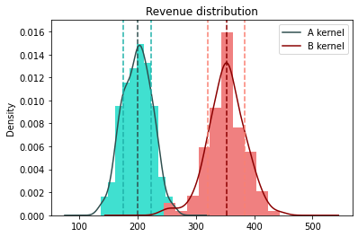

This repository contains the solution for the Spotahome test.

The test and its goals are described in `DATA SCIENTIST TECHNICAL EXERCISE.pdf`.
Please read it before continue.

The code to solve the exercise is contained in `david_pastor_exercise.ipynb`.

In order to run it you must install the necesary libraries.
```bash
pip install -r requirements
```

The problem dataset is contained in `Data scientist exercise.db`

# EDA 
After exploring the variables everything looks normal but some insight can be highlighted.

### Events and time dependency


    

    
Data seems synthetic as there is no obvious correlation between the events and time.

### Booking request distribution
   

    
The main consequence for the exercise is that booking_request are homogeneously distributed in the users lifetime.

That means it can take up to 27 days to book for a particular user.
Thus, user data for user with less than 27 days of data are not reliables for this analysis if this were not a toy exercise.

# Removing bad data

### User assigned to both variants 

After inspecting visually and statistically some of the user assigned to both variants and comparing with the properly assigned 
I cannot see anything special.

They have similar distributions on any feature.

It is only the 5% of data so **better ignore this not reliable rows**.

<div>
<style scoped>
    .dataframe tbody tr th:only-of-type {
        vertical-align: middle;
    }

    .dataframe tbody tr th {
        vertical-align: top;
    }

    .dataframe thead th {
        text-align: right;
    }
</style>
<table border="1" class="dataframe">
  <thead>
    <tr style="text-align: right;">
      <th></th>
      <th>datetime</th>
      <th>user_id</th>
      <th>variant</th>
      <th>city</th>
      <th>event_type</th>
      <th>revenue</th>
    </tr>
  </thead>
  <tbody>
    <tr>
      <th>390</th>
      <td>2021-08-01 15:55:00</td>
      <td>103751531</td>
      <td>A</td>
      <td>rome</td>
      <td>property_view</td>
      <td>NaN</td>
    </tr>
    <tr>
      <th>2823</th>
      <td>2021-08-05 16:52:54</td>
      <td>103751531</td>
      <td>A</td>
      <td>rome</td>
      <td>property_view</td>
      <td>NaN</td>
    </tr>
    <tr>
      <th>3012</th>
      <td>2021-08-05 23:33:06</td>
      <td>103751531</td>
      <td>B</td>
      <td>rome</td>
      <td>property_view</td>
      <td>NaN</td>
    </tr>
    <tr>
      <th>3293</th>
      <td>2021-08-06 09:56:24</td>
      <td>103751531</td>
      <td>A</td>
      <td>rome</td>
      <td>property_view</td>
      <td>NaN</td>
    </tr>
    <tr>
      <th>3713</th>
      <td>2021-08-07 01:28:39</td>
      <td>103751531</td>
      <td>B</td>
      <td>rome</td>
      <td>property_view</td>
      <td>NaN</td>
    </tr>
    <tr>
      <th>4610</th>
      <td>2021-08-08 11:02:46</td>
      <td>103751531</td>
      <td>B</td>
      <td>rome</td>
      <td>property_view</td>
      <td>NaN</td>
    </tr>
    <tr>
      <th>5548</th>
      <td>2021-08-09 23:21:15</td>
      <td>103751531</td>
      <td>A</td>
      <td>rome</td>
      <td>property_view</td>
      <td>NaN</td>
    </tr>
    <tr>
      <th>6930</th>
      <td>2021-08-12 06:30:38</td>
      <td>103751531</td>
      <td>B</td>
      <td>rome</td>
      <td>property_view</td>
      <td>NaN</td>
    </tr>
    <tr>
      <th>7527</th>
      <td>2021-08-13 05:54:27</td>
      <td>103751531</td>
      <td>A</td>
      <td>rome</td>
      <td>property_view</td>
      <td>NaN</td>
    </tr>
    <tr>
      <th>8868</th>
      <td>2021-08-15 12:09:11</td>
      <td>103751531</td>
      <td>B</td>
      <td>rome</td>
      <td>property_view</td>
      <td>NaN</td>
    </tr>
    <tr>
      <th>9063</th>
      <td>2021-08-15 18:36:04</td>
      <td>103751531</td>
      <td>A</td>
      <td>rome</td>
      <td>property_view</td>
      <td>NaN</td>
    </tr>
    <tr>
      <th>9251</th>
      <td>2021-08-16 02:31:42</td>
      <td>103751531</td>
      <td>B</td>
      <td>rome</td>
      <td>property_view</td>
      <td>NaN</td>
    </tr>
    <tr>
      <th>9968</th>
      <td>2021-08-17 05:28:00</td>
      <td>103751531</td>
      <td>A</td>
      <td>rome</td>
      <td>property_view</td>
      <td>NaN</td>
    </tr>
    <tr>
      <th>10804</th>
      <td>2021-08-18 15:36:10</td>
      <td>103751531</td>
      <td>A</td>
      <td>rome</td>
      <td>property_view</td>
      <td>NaN</td>
    </tr>
    <tr>
      <th>13080</th>
      <td>2021-08-22 06:37:25</td>
      <td>103751531</td>
      <td>B</td>
      <td>rome</td>
      <td>property_view</td>
      <td>NaN</td>
    </tr>
    <tr>
      <th>13559</th>
      <td>2021-08-23 01:22:35</td>
      <td>103751531</td>
      <td>B</td>
      <td>rome</td>
      <td>property_view</td>
      <td>NaN</td>
    </tr>
    <tr>
      <th>14062</th>
      <td>2021-08-23 20:52:55</td>
      <td>103751531</td>
      <td>B</td>
      <td>rome</td>
      <td>property_view</td>
      <td>NaN</td>
    </tr>
    <tr>
      <th>14692</th>
      <td>2021-08-24 20:23:24</td>
      <td>103751531</td>
      <td>A</td>
      <td>rome</td>
      <td>property_view</td>
      <td>NaN</td>
    </tr>
    <tr>
      <th>15646</th>
      <td>2021-08-26 10:47:05</td>
      <td>103751531</td>
      <td>B</td>
      <td>rome</td>
      <td>property_view</td>
      <td>NaN</td>
    </tr>
    <tr>
      <th>16154</th>
      <td>2021-08-27 06:36:46</td>
      <td>103751531</td>
      <td>B</td>
      <td>rome</td>
      <td>property_view</td>
      <td>NaN</td>
    </tr>
    <tr>
      <th>16445</th>
      <td>2021-08-27 18:51:23</td>
      <td>103751531</td>
      <td>A</td>
      <td>rome</td>
      <td>property_view</td>
      <td>NaN</td>
    </tr>
  </tbody>
</table>
</div>


### Users with two request

Only one user preform more than one user request.
It also have mixed variant values so is ignored anyway

<div>
<style scoped>
    .dataframe tbody tr th:only-of-type {
        vertical-align: middle;
    }

    .dataframe tbody tr th {
        vertical-align: top;
    }

    .dataframe thead th {
        text-align: right;
    }
</style>
<table border="1" class="dataframe">
  <thead>
    <tr style="text-align: right;">
      <th></th>
      <th>datetime</th>
      <th>user_id</th>
      <th>variant</th>
      <th>city</th>
      <th>event_type</th>
      <th>revenue</th>
    </tr>
  </thead>
  <tbody>
    <tr>
      <th>305</th>
      <td>2021-08-01 12:32:48</td>
      <td>859812222</td>
      <td>B</td>
      <td>rome</td>
      <td>property_favorite_added</td>
      <td>NaN</td>
    </tr>
    <tr>
      <th>1170</th>
      <td>2021-08-02 23:48:49</td>
      <td>859812222</td>
      <td>A</td>
      <td>rome</td>
      <td>property_favorite_added</td>
      <td>NaN</td>
    </tr>
    <tr>
      <th>2516</th>
      <td>2021-08-05 05:37:54</td>
      <td>859812222</td>
      <td>A</td>
      <td>rome</td>
      <td>property_view</td>
      <td>NaN</td>
    </tr>
    <tr>
      <th>3119</th>
      <td>2021-08-06 03:55:29</td>
      <td>859812222</td>
      <td>A</td>
      <td>rome</td>
      <td>property_favorite_added</td>
      <td>NaN</td>
    </tr>
    <tr>
      <th>3465</th>
      <td>2021-08-06 16:39:18</td>
      <td>859812222</td>
      <td>B</td>
      <td>rome</td>
      <td>property_favorite_added</td>
      <td>NaN</td>
    </tr>
    <tr>
      <th>3569</th>
      <td>2021-08-06 20:13:22</td>
      <td>859812222</td>
      <td>A</td>
      <td>rome</td>
      <td>property_favorite_added</td>
      <td>NaN</td>
    </tr>
    <tr>
      <th>3664</th>
      <td>2021-08-06 23:51:16</td>
      <td>859812222</td>
      <td>B</td>
      <td>rome</td>
      <td>property_view</td>
      <td>NaN</td>
    </tr>
    <tr>
      <th>3869</th>
      <td>2021-08-07 07:49:11</td>
      <td>859812222</td>
      <td>A</td>
      <td>rome</td>
      <td>booking_request</td>
      <td>229.319360</td>
    </tr>
    <tr>
      <th>3873</th>
      <td>2021-08-07 08:01:35</td>
      <td>859812222</td>
      <td>A</td>
      <td>rome</td>
      <td>property_favorite_added</td>
      <td>NaN</td>
    </tr>
    <tr>
      <th>4187</th>
      <td>2021-08-07 19:37:29</td>
      <td>859812222</td>
      <td>B</td>
      <td>rome</td>
      <td>booking_request</td>
      <td>338.171321</td>
    </tr>
    <tr>
      <th>4250</th>
      <td>2021-08-07 21:55:04</td>
      <td>859812222</td>
      <td>B</td>
      <td>rome</td>
      <td>property_view</td>
      <td>NaN</td>
    </tr>
    <tr>
      <th>4554</th>
      <td>2021-08-08 08:54:49</td>
      <td>859812222</td>
      <td>B</td>
      <td>rome</td>
      <td>property_view</td>
      <td>NaN</td>
    </tr>
    <tr>
      <th>5719</th>
      <td>2021-08-10 05:52:16</td>
      <td>859812222</td>
      <td>A</td>
      <td>rome</td>
      <td>property_favorite_added</td>
      <td>NaN</td>
    </tr>
    <tr>
      <th>5793</th>
      <td>2021-08-10 08:46:36</td>
      <td>859812222</td>
      <td>A</td>
      <td>rome</td>
      <td>property_favorite_added</td>
      <td>NaN</td>
    </tr>
    <tr>
      <th>6175</th>
      <td>2021-08-10 23:48:38</td>
      <td>859812222</td>
      <td>B</td>
      <td>rome</td>
      <td>property_view</td>
      <td>NaN</td>
    </tr>
    <tr>
      <th>6294</th>
      <td>2021-08-11 04:42:23</td>
      <td>859812222</td>
      <td>A</td>
      <td>rome</td>
      <td>property_view</td>
      <td>NaN</td>
    </tr>
    <tr>
      <th>7093</th>
      <td>2021-08-12 13:35:02</td>
      <td>859812222</td>
      <td>A</td>
      <td>rome</td>
      <td>property_view</td>
      <td>NaN</td>
    </tr>
    <tr>
      <th>8178</th>
      <td>2021-08-14 08:56:46</td>
      <td>859812222</td>
      <td>B</td>
      <td>rome</td>
      <td>property_favorite_added</td>
      <td>NaN</td>
    </tr>
    <tr>
      <th>8191</th>
      <td>2021-08-14 09:30:05</td>
      <td>859812222</td>
      <td>A</td>
      <td>rome</td>
      <td>property_view</td>
      <td>NaN</td>
    </tr>
    <tr>
      <th>9773</th>
      <td>2021-08-16 21:31:46</td>
      <td>859812222</td>
      <td>B</td>
      <td>rome</td>
      <td>property_favorite_added</td>
      <td>NaN</td>
    </tr>
    <tr>
      <th>9874</th>
      <td>2021-08-17 01:53:22</td>
      <td>859812222</td>
      <td>A</td>
      <td>rome</td>
      <td>property_view</td>
      <td>NaN</td>
    </tr>
    <tr>
      <th>10701</th>
      <td>2021-08-18 12:05:34</td>
      <td>859812222</td>
      <td>A</td>
      <td>rome</td>
      <td>property_view</td>
      <td>NaN</td>
    </tr>
    <tr>
      <th>10730</th>
      <td>2021-08-18 13:02:38</td>
      <td>859812222</td>
      <td>A</td>
      <td>rome</td>
      <td>property_view</td>
      <td>NaN</td>
    </tr>
    <tr>
      <th>11025</th>
      <td>2021-08-19 00:56:11</td>
      <td>859812222</td>
      <td>A</td>
      <td>rome</td>
      <td>property_view</td>
      <td>NaN</td>
    </tr>
    <tr>
      <th>11443</th>
      <td>2021-08-19 15:26:59</td>
      <td>859812222</td>
      <td>A</td>
      <td>rome</td>
      <td>property_view</td>
      <td>NaN</td>
    </tr>
    <tr>
      <th>11970</th>
      <td>2021-08-20 11:42:43</td>
      <td>859812222</td>
      <td>B</td>
      <td>rome</td>
      <td>property_view</td>
      <td>NaN</td>
    </tr>
    <tr>
      <th>13224</th>
      <td>2021-08-22 12:34:36</td>
      <td>859812222</td>
      <td>B</td>
      <td>rome</td>
      <td>property_view</td>
      <td>NaN</td>
    </tr>
    <tr>
      <th>15537</th>
      <td>2021-08-26 06:33:59</td>
      <td>859812222</td>
      <td>B</td>
      <td>rome</td>
      <td>property_favorite_added</td>
      <td>NaN</td>
    </tr>
    <tr>
      <th>15767</th>
      <td>2021-08-26 16:10:08</td>
      <td>859812222</td>
      <td>A</td>
      <td>rome</td>
      <td>property_view</td>
      <td>NaN</td>
    </tr>
  </tbody>
</table>
</div>

### zero revenue

There are few samples with zero revenue.

There is nothing special on this users data.

Probably there is an explanation for this events so I would ask the service developers before excluding this rows for the analysis in a real situation.

As long as I cannot do this, I will exclude the user related with this booking requests.

They represent only the 2% anyway.

<div>
<style scoped>
    .dataframe tbody tr th:only-of-type {
        vertical-align: middle;
    }

    .dataframe tbody tr th {
        vertical-align: top;
    }

    .dataframe thead th {
        text-align: right;
    }
</style>
<table border="1" class="dataframe">
  <thead>
    <tr style="text-align: right;">
      <th></th>
      <th>datetime</th>
      <th>user_id</th>
      <th>variant</th>
      <th>city</th>
      <th>event_type</th>
      <th>revenue</th>
    </tr>
  </thead>
  <tbody>
    <tr>
      <th>635</th>
      <td>2021-08-02 02:28:12</td>
      <td>928239809</td>
      <td>A</td>
      <td>rome</td>
      <td>booking_request</td>
      <td>0.0</td>
    </tr>
    <tr>
      <th>3939</th>
      <td>2021-08-07 10:32:54</td>
      <td>928239809</td>
      <td>A</td>
      <td>rome</td>
      <td>property_favorite_added</td>
      <td>NaN</td>
    </tr>
    <tr>
      <th>4856</th>
      <td>2021-08-08 20:01:13</td>
      <td>928239809</td>
      <td>A</td>
      <td>rome</td>
      <td>property_view</td>
      <td>NaN</td>
    </tr>
    <tr>
      <th>5249</th>
      <td>2021-08-09 12:08:08</td>
      <td>928239809</td>
      <td>A</td>
      <td>rome</td>
      <td>property_view</td>
      <td>NaN</td>
    </tr>
    <tr>
      <th>5798</th>
      <td>2021-08-10 08:53:53</td>
      <td>928239809</td>
      <td>A</td>
      <td>rome</td>
      <td>property_view</td>
      <td>NaN</td>
    </tr>
    <tr>
      <th>5996</th>
      <td>2021-08-10 16:46:00</td>
      <td>928239809</td>
      <td>A</td>
      <td>rome</td>
      <td>property_favorite_added</td>
      <td>NaN</td>
    </tr>
    <tr>
      <th>7127</th>
      <td>2021-08-12 14:49:21</td>
      <td>928239809</td>
      <td>A</td>
      <td>rome</td>
      <td>property_view</td>
      <td>NaN</td>
    </tr>
    <tr>
      <th>8707</th>
      <td>2021-08-15 05:20:55</td>
      <td>928239809</td>
      <td>A</td>
      <td>rome</td>
      <td>property_favorite_added</td>
      <td>NaN</td>
    </tr>
    <tr>
      <th>9621</th>
      <td>2021-08-16 16:00:03</td>
      <td>928239809</td>
      <td>A</td>
      <td>rome</td>
      <td>property_favorite_added</td>
      <td>NaN</td>
    </tr>
    <tr>
      <th>10948</th>
      <td>2021-08-18 21:59:27</td>
      <td>928239809</td>
      <td>A</td>
      <td>rome</td>
      <td>property_view</td>
      <td>NaN</td>
    </tr>
    <tr>
      <th>11602</th>
      <td>2021-08-19 21:36:47</td>
      <td>928239809</td>
      <td>A</td>
      <td>rome</td>
      <td>property_view</td>
      <td>NaN</td>
    </tr>
    <tr>
      <th>13665</th>
      <td>2021-08-23 05:20:21</td>
      <td>928239809</td>
      <td>A</td>
      <td>rome</td>
      <td>property_view</td>
      <td>NaN</td>
    </tr>
    <tr>
      <th>14089</th>
      <td>2021-08-23 22:06:59</td>
      <td>928239809</td>
      <td>A</td>
      <td>rome</td>
      <td>property_favorite_added</td>
      <td>NaN</td>
    </tr>
    <tr>
      <th>15277</th>
      <td>2021-08-25 19:44:56</td>
      <td>928239809</td>
      <td>A</td>
      <td>rome</td>
      <td>property_view</td>
      <td>NaN</td>
    </tr>
    <tr>
      <th>16455</th>
      <td>2021-08-27 19:11:36</td>
      <td>928239809</td>
      <td>A</td>
      <td>rome</td>
      <td>property_view</td>
      <td>NaN</td>
    </tr>
  </tbody>
</table>
</div>


## Remove all the data mention before

Acording to the analysis all the previous data with errors will be removed

# Questions to answer

## Conversion rate

What is the uplift or down-lift in the treatment group, if there’s any?

Is it statistically significant at 95% or 99% level? 

Indicate the kind of test performed and p-value.

### Answer
First lets visualize the data

<div>
<style scoped>
    .dataframe tbody tr th:only-of-type {
        vertical-align: middle;
    }

    .dataframe tbody tr th {
        vertical-align: top;
    }

    .dataframe thead th {
        text-align: right;
    }
</style>
<table border="1" class="dataframe">
  <thead>
    <tr style="text-align: right;">
      <th></th>
      <th>all cities</th>
    </tr>
    <tr>
      <th>variant</th>
      <th></th>
    </tr>
  </thead>
  <tbody>
    <tr>
      <th>A</th>
      <td>48.449901</td>
    </tr>
    <tr>
      <th>B</th>
      <td>62.446052</td>
    </tr>
  </tbody>
</table>
</div>


<div>
<style scoped>
    .dataframe tbody tr th:only-of-type {
        vertical-align: middle;
    }

    .dataframe tbody tr th {
        vertical-align: top;
    }

    .dataframe thead th {
        text-align: right;
    }
</style>
<table border="1" class="dataframe">
  <thead>
    <tr style="text-align: right;">
      <th>city</th>
      <th>london</th>
      <th>madrid</th>
      <th>rome</th>
    </tr>
    <tr>
      <th>variant</th>
      <th></th>
      <th></th>
      <th></th>
    </tr>
  </thead>
  <tbody>
    <tr>
      <th>A</th>
      <td>42.140444</td>
      <td>48.079464</td>
      <td>49.650687</td>
    </tr>
    <tr>
      <th>B</th>
      <td>75.067195</td>
      <td>55.136330</td>
      <td>70.029195</td>
    </tr>
  </tbody>
</table>
</div>
    


It is clear that cities cannot be treated altogether

Conversion rate distributions independence for group A and B is evaluated with the χ² of independence of variables.

<div>
<style scoped>
    .dataframe tbody tr th:only-of-type {
        vertical-align: middle;
    }

    .dataframe tbody tr th {
        vertical-align: top;
    }

    .dataframe thead th {
        text-align: right;
    }
</style>
<table border="1" class="dataframe">
  <thead>
    <tr style="text-align: right;">
      <th></th>
      <th>booking</th>
      <th>not_booking</th>
    </tr>
    <tr>
      <th>variant</th>
      <th></th>
      <th></th>
    </tr>
  </thead>
  <tbody>
    <tr>
      <th>A</th>
      <td>196</td>
      <td>610</td>
    </tr>
    <tr>
      <th>B</th>
      <td>144</td>
      <td>668</td>
    </tr>
  </tbody>
</table>
</div>


    p_value = 0.001


Groups are statistically independent with a high level of significance

Now, the process is repeated considering each city independently

<div>
<style scoped>
    .dataframe tbody tr th:only-of-type {
        vertical-align: middle;
    }

    .dataframe tbody tr th {
        vertical-align: top;
    }

    .dataframe thead th {
        text-align: right;
    }
</style>
<table border="1" class="dataframe">
  <thead>
    <tr style="text-align: right;">
      <th></th>
      <th>booking</th>
      <th>not_booking</th>
    </tr>
    <tr>
      <th>variant</th>
      <th></th>
      <th></th>
    </tr>
  </thead>
  <tbody>
    <tr>
      <th>A</th>
      <td>86</td>
      <td>259</td>
    </tr>
    <tr>
      <th>B</th>
      <td>68</td>
      <td>273</td>
    </tr>
  </tbody>
</table>
</div>


    rome p_value = 0.141
    
    


<div>
<style scoped>
    .dataframe tbody tr th:only-of-type {
        vertical-align: middle;
    }

    .dataframe tbody tr th {
        vertical-align: top;
    }

    .dataframe thead th {
        text-align: right;
    }
</style>
<table border="1" class="dataframe">
  <thead>
    <tr style="text-align: right;">
      <th></th>
      <th>booking</th>
      <th>not_booking</th>
    </tr>
    <tr>
      <th>variant</th>
      <th></th>
      <th></th>
    </tr>
  </thead>
  <tbody>
    <tr>
      <th>A</th>
      <td>101</td>
      <td>319</td>
    </tr>
    <tr>
      <th>B</th>
      <td>67</td>
      <td>361</td>
    </tr>
  </tbody>
</table>
</div>


    madrid p_value = 0.003
    
    


<div>
<style scoped>
    .dataframe tbody tr th:only-of-type {
        vertical-align: middle;
    }

    .dataframe tbody tr th {
        vertical-align: top;
    }

    .dataframe thead th {
        text-align: right;
    }
</style>
<table border="1" class="dataframe">
  <thead>
    <tr style="text-align: right;">
      <th></th>
      <th>booking</th>
      <th>not_booking</th>
    </tr>
    <tr>
      <th>variant</th>
      <th></th>
      <th></th>
    </tr>
  </thead>
  <tbody>
    <tr>
      <th>A</th>
      <td>9</td>
      <td>32</td>
    </tr>
    <tr>
      <th>B</th>
      <td>9</td>
      <td>34</td>
    </tr>
  </tbody>
</table>
</div>


    london p_value = 1.000
    
    


We can only affirm that the independence significance is high for Madrid

Probably the experiment do not affect significantly to London and Rome conversion rate

## Revenue per user

What is the uplift or down-lift in the treatment group, if there’s any? Is it

statistically significant at 95% or 99% level? 

Indicate the kind of test performed and p-value.

Remember we mean revenue per “website visitor”, not just per “user that converted”.

### Answer
First lets visualize the data
    


It is clear that distributions are not similar even if they do not split by city.

Still, lets perform the two-sample Kolmogorov-Smirnov test for goodness of fit to prove it.

    all cities p-value = 6.4e-95
    london p-value = 4.1e-05
    madrid p-value = 7.3e-12
    rome p-value = 1.8e-35


## Question
What would be your recommendation to stakeholders regarding rolling out or rolling back the experiment?

### Answer
**The price increment must be fit by city not globally**

## Increase ratio
The stakeholder forgot what was the % increase in fees applied in the treatment group, so let’s try to find out:

* Create a plot that shows a kernel density estimate of the revenue value for the booking requests, creating one different line per variant.
What can be learned from this plot?
* Can you determine the “average” revenue per booking request in each variant, with a confidence interval of 95%? (e.g. “352.25 euros +/- 22.3 euros” , or “[329.95, 375.55] euros”).
Choose an appropriate distribution as assumption.
* Finally, determine what was the percentage increase of the fees in treatment group. It is a reliable determination?

### Answer

    A median distribution value = 199±48
    B median distribution value = 352±63
    

   

Both distributions fit to a gaussian.

Taking advantage of this is possible to estimate the average revenue per booking with a 95% confidence interval:
* A median distribution value = 199±48
* B median distribution value = 352±63

With this information is possible to calculate te percentage increase as

$increase = m_B/m_a-1$

Lets calculate it with the error.

The increment ratio is 0.8±0.1.
There is only a less than a 10% error.

